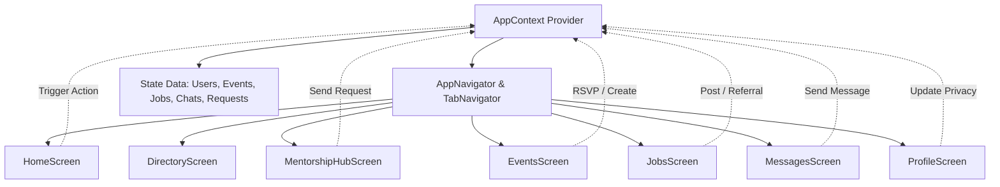

# 🎓 Alumni Network Portal (অ্যালামনাই নেটওয়ার্ক পোর্টাল)
> **বিশ্ববিদ্যালয়ের প্রাক্তন শিক্ষার্থী (Alumni), বর্তমান শিক্ষার্থী (Students) এবং শিক্ষক/অনুষদের (Faculty/Staff) জন্য নির্মিত পূর্ণাঙ্গ ক্রস-প্ল্যাটফর্ম মোবাইল অ্যাপ্লিকেশন।**

---

## 📑 সূচিপত্র (Table of Contents)

1. [প্রকল্প পরিচিতি ও লক্ষ্য (Project Overview)](#-১-প্রকল্প-পরিচিতি-ও-লক্ষ্য-project-overview)
2. [প্রযুক্তি স্ট্যাক (Tech Stack)](#-২-প্রযুক্তি-স্ট্যাক-tech-stack)
3. [ফোল্ডার ও ফাইল আর্কিটেকচার (Folder & File Structure)](#-৩-ফোল্ডার-ও-ফাইল-আর্কিটেকচার-folder--file-structure)
4. [অ্যাপের মূল ফিচারসমূহ ও কাজের প্রণালী (Core Features & How They Work)](#-৪-অ্যাপের-মূল-ফিচারসমূহ-ও-কাজের-প্রণালী-core-features--how-they-work)
   - [৪.১ অথেন্টিকেশন ও অনবোর্ডিং (Auth & Onboarding)](#৪১-অথেন্টিকেশন-ও-অনবোর্ডিং-auth--onboarding)
   - [৪.২ হোম ড্যাশবোর্ড (Home Dashboard)](#৪২-হোম-ড্যাশবোর্ড-home-dashboard)
   - [৪.৩ অ্যালামনাই ডিরেক্টরি ও প্রোফাইল (Directory & Profiles)](#৪৩-অ্যালামনাই-ডিরেক্টরি-ও-প্রোফাইল-directory--profiles)
   - [৪.৪ ১:১ মেন্টরশিপ হাব (1:1 Mentorship Hub)](#৪৪-১১-মেন্টরশিপ-হাব-11-mentorship-hub)
   - [৪.৫ ডিরেক্ট মেসেজিং ও চ্যাপ্টার/ক্লাব (Messaging & Chapters)](#৪৫-ডিরেক্ট-মেসেজিং-ও-চ্যাপ্টারক্লাব-messaging--chapters)
   - [৪.৬ ইভেন্ট ও পুনর্মিলনী (Events & Reunions)](#৪৬-ইভেন্ট-ও-পুনর্মিলনী-events--reunions)
   - [৪.৭ জব বোর্ড ও অ্যালামনাই রেফারাল (Job Board & Referrals)](#৪৭-জব-বোর্ড-ও-অ্যালামনাই-রেফারাল-job-board--referrals)
   - [৪.৮ নোটিফিকেশন সেন্টার (Notification Center)](#৪৮-নোটিফিকেশন-সেন্টার-notification-center)
   - [৪.৯ ফিল্ড-লেভেল প্রাইভেসি কন্ট্রোল (Privacy Settings)](#৪৯-ফিল্ড-লেভেল-প্রাইভেসি-কন্ট্রোল-privacy-settings)
   - [৪.১০ সেফটি, ইউজার রিপোর্টিং ও মডারেশন (Safety & Moderation)](#৪১০-সেফটি-ইউজার-রিপোর্টিং-ও-মডারেশন-safety--moderation)
5. [ডিজাইন সিস্টেম ও UI/UX কাঠামো (Design System)](#-৫-ডিজাইন-সিস্টেম-ও-uiux-কাঠামো-design-system)
   - [৫.১ কালার প্যালেট (Color Palette)](#৫১-কালার-প্যালেট-color-palette)
   - [৫.২ শ্যাডো ও এলিভেশন (Shadows & Elevation)](#৫২-শ্যাডো-ও-এলিভেশন-shadows--elevation)
   - [৫.৩ কমন কম্পোনেন্টস (Shared Components)](#৫৩-কমন-কম্পোনেন্টস-shared-components)
6. [স্টেট ম্যানেজমেন্ট ও ডেটা ফ্লো (State Management & Data Flow)](#-৬-স্টেট-ম্যানেজমেন্ট-ও-ডেটা-ফ্লো-state-management--data-flow)
7. [পারসোনা ও রোল-ভিত্তিক অ্যাক্সেস (Role-based Personas)](#-৭-পারসোনা-ও-রোল-ভিত্তিক-অ্যাক্সেস-role-based-personas)
8. [লোকালি রান করার নির্দেশিকা (Getting Started)](#-৮-লোকালি-রান-করার-নির্দেশিকা-getting-started)
9. [গিটহাবে পুশ করার নির্দেশিকা (Git Push Guide)](#-৯-গিটহাবে-পুশ-করার-নির্দেশিকা-git-push-guide)

---

## 🌟 ১. প্রকল্প পরিচিতি ও লক্ষ্য (Project Overview)

**Alumni Network Portal** হলো একটি আধুনিক, স্কেলেবল মোবাইল অ্যাপ যা বিশ্ববিদ্যালয়ের শিক্ষার্থী, প্রাক্তন শিক্ষার্থী এবং ফ্যাকাল্টি মেম্বারদের মাঝে একটি পারস্পরিক সহযোগিতামূলক সেতু বন্ধন তৈরি করে।

### এর মাধ্যমে যা যা সমাধান করা হয়েছে:
* **মেন্টরশিপ গ্যাপ দূরীকরণ:** ছাত্র-ছাত্রীরা তাদের পছন্দের ইন্ডাস্ট্রির সিনিয়র অ্যালামনাইদের সরাসরি মেন্টর হিসেবে রিকোয়েস্ট পাঠাতে পারে।
* **ক্যারিয়ার সুযোগ ও রেফারাল:** অ্যালামনাইরা তাদের প্রতিষ্ঠানে খালি পদের বিজ্ঞাপন দিতে পারে এবং শিক্ষার্থীরা সরাসরি অ্যালামনাই রেফারাল চাইতে পারে।
* **কানেক্টিভিটি ও রিউনিয়ন:** ডিপার্টমেন্টভিত্তিক বা আঞ্চলিক চ্যাপ্টারে যুক্ত হয়ে নেটওয়ার্কিং ও বিশ্ববিদ্যালয়ের ইভেন্টে অংশ নেওয়া যায়।
* **নিরাপত্তা ও প্রাইভেসি:** ব্যবহারকারীরা সিদ্ধান্ত নিতে পারেন তাদের কোন তথ্য (ইমেইল, ফোন, ক্যারিয়ার হিস্ট্রি) পাবলিক থাকবে, কোনটি কেবল অ্যালামনাইরা দেখবে, আর কোনটি লুকানো থাকবে।

---

## 🛠 ২. প্রযুক্তি স্ট্যাক (Tech Stack)

| উপাদান | প্রযুক্তি / লাইব্রেরি | বিবরণ |
|---|---|---|
| **ফ্রেমওয়ার্ক** | [Expo SDK 51](https://expo.dev/) & [React Native 0.74.5](https://reactnative.dev/) | ক্রস-প্ল্যাটফর্ম (Android, iOS, Web) সাপোর্ট |
| **ভাষা** | [TypeScript 5.3](https://www.typescriptlang.org/) | শক্তিশালী টাইপ-সেফটি এবং এরর মুক্ত কোডিং |
| **নেভিগেশন** | `@react-navigation/native-stack` & `@react-navigation/bottom-tabs` | স্মুথ ট্রানজিশন ও আধুনিক বটম ট্যাব বার |
| **স্টেট ম্যানেজমেন্ট** | React Context API (`AppContext.tsx`) | কেন্দ্রীয় ডেটা ফ্লো ও রিয়েল-টাইম স্টেট আপডেট |
| **আইকন ও গ্রাফিক্স** | `@expo/vector-icons` (Ionicons) & `expo-linear-gradient` | প্রিমিয়াম ভিজ্যুয়াল ও আধুনিক গ্রেডিয়েন্ট |
| **লোকাল স্টোরেজ** | `@react-native-async-storage/async-storage` | লোকাল ডেটা ক্যাশিং ও পারসিস্টেন্স |
| **সেফ এরিয়া** | `react-native-safe-area-context` & `react-native-screens` | সব ধরনের নচ ও আধুনিক স্ক্রিনের সাথে সামঞ্জস্য |

---

## 📁 ৩. ফোল্ডার ও ফাইল আর্কিটেকচার (Folder & File Structure)

প্রজেক্টটি অত্যন্ত সুসংগঠিত মডিউলার আর্কিটেকচার অনুসরণ করে তৈরি করা হয়েছে:

```
alumni-network-portal/
├── App.tsx                          # অ্যাপের মূল এন্ট্রি পয়েন্ট (SafeAreaProvider, AppProvider, Navigation)
├── app.json                         # Expo কনফিগারেশন ও বিল্ড মেটাডাটা
├── package.json                     # ডিপেন্ডেন্সি ও স্ক্রিপ্টসমূহ
├── tsconfig.json                    # টাইপস্ক্রিপ্ট কনফিগারেশন
│
└── src/
    ├── api/                         # ডেটা মডেল ও মক ডেটা
    │   ├── types.ts                 # সমস্ত TypeScript ইন্টারফেস ও টাইপ ডেফিনিশন
    │   └── mockData.ts              # বাস্তবসম্মত ডেমো ডেটা (ইউজার, জব, ইভেন্ট, গ্রুপ ইত্যাদি)
    │
    ├── components/                  # রিইউজেবল UI কম্পোনেন্টস
    │   └── common/
    │       ├── AuthGate.tsx         # অননুমোদিত ইউজারদের অ্যাক্সেস বাধা ও ডেমো লগইন প্রম্পট
    │       ├── Badge.tsx            # স্ট্যাটাস, রোল এবং ট্যাগ ব্যাজ কম্পোনেন্ট
    │       ├── Header.tsx           # শীর্ষ হেডার বার (টাইটেল, লোগো, নোটিফিকেশন আইকন)
    │       ├── PersonaSwitcher.tsx  # ইনস্ট্যান্ট ডেমো পারসোনা পরিবর্তনকারী প্যানেল
    │       ├── ProgressBar.tsx      # ইভেন্ট ক্যাপাসিটি ও প্রোফাইল কমপ্লিশন বার
    │       └── SearchInput.tsx      # ক্লিয়ার বাটন সহ অ্যাডভান্সড সার্চ ইনপুট বক্স
    │
    ├── constants/
    │   └── theme.ts                 # কালার প্যালেট, ফন্ট, শ্যাডো এবং ইউনিভার্সিটি কনফিগারেশন
    │
    ├── navigation/                  # স্ক্রিন নেভিগেশন কনফিগারেশন
    │   ├── AppNavigator.tsx         # রুট নেটিভ স্ট্যাক নেভিগেটর (মডাল ও সাব-স্ক্রিনসমূহ)
    │   └── TabNavigator.tsx         # বটম ট্যাব নেভিগেটর (Home, Directory, Connect, Mentorship, Events, Me)
    │
    ├── screens/                     # সমস্ত অ্যাপ্লিকেশন স্ক্রিন
    │   ├── auth/                    # লগইন, রেজিস্ট্রেশন ও অনবোর্ডিং
    │   │   ├── LoginScreen.tsx
    │   │   ├── RegisterScreen.tsx
    │   │   └── OnboardingScreen.tsx
    │   ├── home/                    # ড্যাশবোর্ড ও অ্যানাউন্সমেন্ট
    │   │   └── HomeScreen.tsx
    │   ├── directory/               # মেম্বার খোঁজা ও পাবলিক প্রোফাইল
    │   │   ├── DirectoryScreen.tsx
    │   │   ├── ProfileDetailScreen.tsx
    │   │   └── PublicPreviewModal.tsx
    │   ├── mentorship/              # মেন্টরশিপ রিকোয়েস্ট ও সেশন
    │   │   └── MentorshipHubScreen.tsx
    │   ├── events/                  # ইভেন্ট দেখা, আরএসভিপি ও নতুন ইভেন্ট তৈরি
    │   │   ├── EventsListScreen.tsx
    │   │   ├── EventDetailScreen.tsx
    │   │   └── CreateEventScreen.tsx
    │   ├── jobs/                    # ক্যারিয়ার পোর্টাল, রেফারাল ও জব পোস্টিং
    │   │   ├── JobBoardScreen.tsx
    │   │   ├── JobDetailScreen.tsx
    │   │   └── PostJobScreen.tsx
    │   ├── messages/                # ১:১ চ্যাট ও রিজিওনাল চ্যাপ্টার্স
    │   │   ├── ConversationsListScreen.tsx
    │   │   ├── ChatScreen.tsx
    │   │   └── GroupsScreen.tsx
    │   ├── notifications/           # নোটিফিকেশন সেন্টার
    │   │   └── NotificationCenterScreen.tsx
    │   └── profile/                 # নিজের প্রোফাইল ও প্রাইভেসি সেটিংস
    │       ├── MyProfileScreen.tsx
    │       └── PrivacySettingsScreen.tsx
    │
    └── store/                       # গ্লোবাল স্টেট ম্যানেজমেন্ট
        └── AppContext.tsx           # রিয়্যাক্ট কনটেক্সট প্রোভাইডার ও হ্যান্ডলার ফাংশনসমূহ
```

---

## ⚡ ৪. অ্যাপের মূল ফিচারসমূহ ও কাজের প্রণালী (Core Features & How They Work)

### ৪.১ অথেন্টিকেশন ও অনবোর্ডিং (Auth & Onboarding)
* **কোড ফাইলসমূহ:**
  - `src/screens/auth/LoginScreen.tsx`
  - `src/screens/auth/RegisterScreen.tsx`
  - `src/screens/auth/OnboardingScreen.tsx`
  - `src/components/common/AuthGate.tsx`
* **কীভাবে কাজ করে:**
  - ব্যবহারকারী ইমেইল ও পাসওয়ার্ড দিয়ে লগইন করতে পারেন অথবা নতুন অ্যাকাউন্ট খোলার জন্য রোল নির্বাচন (Alumni, Student, Staff) করে সাইন আপ করতে পারেন।
  - দ্রুত টেস্টিং এবং প্রিভিউ-এর সুবিধার্থে `LoginScreen` এবং `AuthGate`-এ **Quick Demo Persona Switcher** যুক্ত রয়েছে, যাতে এক ক্লিকেই Sarah Jenkins (Alumni Mentor), Alex Rivera (Student), বা Dean Vance (Staff) হিসেবে লগইন করা যায়।
  - অনবোর্ডিং স্ক্রিনে অ্যাপের মূল বৈশিষ্ট্যসমূহের সুন্দর স্লাইডার/ক্যারোসেল প্রদর্শিত হয়।

---

### ৪.২ হোম ড্যাশবোর্ড (Home Dashboard)
* **কোড ফাইল:** `src/screens/home/HomeScreen.tsx`
* **কীভাবে কাজ করে:**
  - **University Crest & Welcome:** বিশ্ববিদ্যালয়ের নাম (`Apex State University`), মূলমন্ত্র এবং ব্যবহারকারীকে শুভেচ্ছা বার্তা দেখায়।
  - **লাইভ স্ট্যাটিস্টিকস বার:** সর্বমোট অ্যালামনাই (১২.৫ হাজার+), অ্যাক্টিভ মেন্টর (৩২০+), আসন্ন ইভেন্টের সংখ্যা এবং রিজিয়নাল চ্যাপ্টার সংখ্যা প্রদর্শন করে।
  - **কুইক অ্যাক্সেস গ্রিড:** ডিরেক্টরি, মেন্টরশিপ, মেসেজ, ইভেন্ট, চ্যাপ্টার্স এবং প্রাইভেসি সেটিংসে সরাসরি যাওয়ার নেভিগেশন কার্ড।
  - **ক্যাম্পাস অ্যানাউন্সমেন্ট ক্যারোসেল:** বিশ্ববিদ্যালয়ের সাম্প্রতিক ঘোষণা, হোমকামিং নোটিশ বা রিসার্চ আপডেট হরিজন্টাল স্ক্রলে দেখা যায়।
  - **ফিচার্ড মেন্টর স্লাইডার:** সপ্তাহের সেরা অ্যালামনাই মেন্টরদের তালিকা, যেখান থেকে সরাসরি তাদের বায়ো দেখে কানেক্ট করা যায়।
  - **নেক্সট ইভেন্ট হাইলাইট কার্ড:** সবচেয়ে নিকটবর্তী আসন্ন ক্যাম্পাসের মিলনমেলা ও ইভেন্ট সরাসরি বুক করার অপশন।

---

### ৪.৩ অ্যালামনাই ডিরেক্টরি ও প্রোফাইল (Directory & Profiles)
* **কোড ফাইলসমূহ:**
  - `src/screens/directory/DirectoryScreen.tsx`
  - `src/screens/directory/ProfileDetailScreen.tsx`
  - `src/screens/directory/PublicPreviewModal.tsx`
* **কীভাবে কাজ করে:**
  - **মাল্টি-প্যারামিটার সার্চ ও ফিল্টার:** নাম, পদবি, কোম্পানি, স্কিল দিয়ে সার্চ করা যায়। রোল (All, Alumni, Student, Staff), গ্র্যাজুয়েশন ব্যাচ, ইন্ডাস্ট্রি (Tech, Healthcare, Finance ইত্যাদি) দিয়ে ফিল্টার করা যায়।
  - **প্রোফাইল ডিটেইল কার্ড:** ব্যবহারকারীর ভেরিফায়েড ব্যাজ, বর্তমান কোম্পানি ও পদবি, ডিগ্রি ও পাসের সাল, কাজের পূর্ব অভিজ্ঞতা টাইমলাইন, স্কিল ট্যাগস, লিঙ্কডইন/গিটহাব বাটন প্রদর্শিত হয়।
  - **প্রাইভেসি রেসপন্সিভনেস:** প্রোফাইল ডিটেইল স্ক্রিন দেখার সময় সংশ্লিষ্ট ব্যবহারকারীর প্রাইভেসি সেটিংস মান্য করে সংবেদনশীল ডেটা লুকানো বা ফিল্টার করা হয়।
  - **পাবলিক প্রিভিউ মডাল:** নিজের প্রোফাইলটি সাধারণ ভিজিটরদের কাছে কেমন দেখাবে তা `PublicPreviewModal`-এর মাধ্যমে রিয়েল-টাইমে পরীক্ষা করা যায়।

---

### ৪.৪ ১:১ মেন্টরশিপ হাব (1:1 Mentorship Hub)
* **কোড ফাইল:** `src/screens/mentorship/MentorshipHubScreen.tsx`
* **কীভাবে কাজ করে:**
  - **ডুয়াল ট্যাব ইন্টারফেস:**
    1. *Find Mentors:* অভিজ্ঞ অ্যালামনাই মেন্টরদের ব্রাউজ করা, তাদের মেন্টরিং ক্যাপাসিটি দেখা (যেমন: ২/৩ শিক্ষার্থী বর্তমানে যুক্ত)।
    2. *My Mentorship:* ব্যবহারকারীর নিজস্ব চলমান মেন্টরশিপ, প্রাপ্ত রিকোয়েস্ট এবং প্রেরিত রিকোয়েস্টের স্ট্যাটাস ট্র্যাকিং।
  - **রিকোয়েস্ট পাঠানোর ফ্লো:** একজন শিক্ষার্থী মেন্টরের কাছে আবেদন করার সময় নির্দিষ্ট গোল বেছে নিতে পারেন (Career Guidance, Resume Review, Technical Interview, Networking) এবং ব্যক্তিগত নোট যুক্ত করতে পারেন।
  - **ম্যানেজমেন্ট ও ক্লোজার:** মেন্টররা রিকোয়েস্ট Accept বা Decline করতে পারেন। মেন্টরশিপ সম্পন্ন হলে রেটিং (১-৫ স্টার) ও ফিডব্যাক দিয়ে সেশন সমাপ্ত করা যায়।

---

### ৪.৫ ডিরেক্ট মেসেজিং ও চ্যাপ্টার/ক্লাব (Messaging & Chapters)
* **কোড ফাইলসমূহ:**
  - `src/screens/messages/ConversationsListScreen.tsx`
  - `src/screens/messages/ChatScreen.tsx`
  - `src/screens/messages/GroupsScreen.tsx`
* **কীভাবে কাজ করে:**
  - **১:১ চ্যাট সিস্টেম:** যেকোনো অ্যালামনাই বা শিক্ষার্থীর সাথে ব্যক্তিগত কথোপকথন। মেসেজ অপঠিত থাকলে বটম ট্যাবে রিয়েল-টাইম লাল ব্যাজ কাউন্টার আপডেট হয়।
  - **চ্যাট ইন্টারফেস (`ChatScreen`):** আধুনিক বাবল ডিজাইন (প্রেরক বনাম প্রাপক), সময় স্ট্যাম্প এবং নিরাপদ চ্যাটের গাইডলাইন ব্যানার।
  - **অ্যালামনাই চ্যাপ্টার্স ও গ্রুপ (`GroupsScreen`):** আঞ্চলিক (যেমন: Silicon Valley Chapter) বা বিভাগীয় (CS & Engineering Club) গ্রুপ। গ্রুপে যুক্ত হওয়া/বের হওয়া, নতুন পোস্ট দেওয়া, পোস্টে লাইক দেওয়া এবং কমেন্ট করার পূর্ণাঙ্গ সামাজিক যোগাযোগ ব্যবস্থা।

---

### ৪.৬ ইভেন্ট ও পুনর্মিলনী (Events & Reunions)
* **কোড ফাইলসমূহ:**
  - `src/screens/events/EventsListScreen.tsx`
  - `src/screens/events/EventDetailScreen.tsx`
  - `src/screens/events/CreateEventScreen.tsx`
* **কীভাবে কাজ করে:**
  - **ইভেন্ট ফিল্টারিং:** All, Reunions, Workshops, Networking, Virtual ইত্যাদি ক্যাটাগরিতে বাছাই।
  - **RSVP ও সিট ক্যাপাসিটি ম্যানেজমেন্ট:** লাইভ প্রগ্রেস বারে দেখা যায় কতটি সিট পূরণ হয়েছে। সিট পূর্ণ হয়ে গেলে ব্যবহারকারী স্বয়ংক্রিয়ভাবে **Waitlist** এ চলে যান।
  - **ইভেন্টের ধরন:** ইন-পার্সন ইভেন্টে লোকেশন এবং ভার্চুয়াল/হাইব্রিড ইভেন্টে অনলাইন মিটিং লিঙ্ক সাপোর্ট করে।
  - **ইভেন্ট তৈরি:** ফ্যাকাল্টি বা অথরাইজড অ্যালামনাইরা সরাসরি অ্যাপ থেকে নতুন ইভেন্টের ব্যানার, তারিখ, সময় ও সিট সংখ্যা উল্লেখ করে ইভেন্ট হোস্ট করতে পারেন।

---

### ৪.৭ জব বোর্ড ও অ্যালামনাই রেফারাল (Job Board & Referrals)
* **কোড ফাইলসমূহ:**
  - `src/screens/jobs/JobBoardScreen.tsx`
  - `src/screens/jobs/JobDetailScreen.tsx`
  - `src/screens/jobs/PostJobScreen.tsx`
* **কীভাবে কাজ করে:**
  - **চাকরি ও ইন্টার্নশিপ সার্চ:** ফুল-টাইম, পার্ট-টাইম, ইন্টার্নশিপ, রিমোট ও অন-সাইট চাকরির ক্যাটাগরি।
  - **"Alumni Work Here" ইনসাইট:** কোন কোম্পানিতে কতজন প্রাক্তন শিক্ষার্থী বর্তমানে কর্মরত আছেন তা প্রতিটি চাকরির কার্ডে হাইলাইট করা থাকে।
  - **অভ্যন্তরীণ রেফারাল রিকোয়েস্ট:** শিক্ষার্থীরা আবেদন করার আগে ঐ কোম্পানিতে থাকা নির্দিষ্ট অ্যালামনাইয়ের কাছে তাদের রেজুমে ও কভার নোট সহ সরাসরি রেফারালের আবেদন পাঠাতে পারে।
  - **জব পোস্টিং ও মডারেশন পাইপলাইন:** অ্যালামনাই বা রিক্রুটাররা জব পোস্ট করতে পারেন, যা প্রশাসনিক মডারেশন (`pending_moderation` -> `approved`) পার হয়ে লাইভ হয়।

---

### ৪.৮ নোটিফিকেশন সেন্টার (Notification Center)
* **কোড ফাইল:** `src/screens/notifications/NotificationCenterScreen.tsx`
* **কীভাবে কাজ করে:**
  - মেসেজ, মেন্টরশিপ রিকোয়েস্ট আপডেট, আসন্ন ইভেন্ট রিমাইন্ডার, জব আপডেট এবং সিস্টেম অ্যালার্টের পৃথক ফিল্টার ট্যাব।
  - এক ক্লিকে নির্দিষ্ট নোটিফিকেশন বা সব নোটিফিকেশন রিড করার সুবিধা এবং সংশ্লিষ্ট স্ক্রিনে সরাসরি জাম্প করার অ্যাকশন।

---

### ৪.৯ ফিল্ড-লেভেল প্রাইভেসি কন্ট্রোল (Privacy Settings)
* **কোড ফাইল:** `src/screens/profile/PrivacySettingsScreen.tsx`
* **কীভাবে কাজ করে:**
  - প্রোফাইলের প্রতিটি সংবেদনশীল ফিল্ড যেমন:
    - ইমেইল (Email)
    - ফোন নম্বর (Phone)
    - বর্তমান শহর/লোকেশন (Location)
    - ক্যারিয়ার হিস্ট্রি (Career History)
    - রেজুমে (Resume)
  - প্রতিটি ফিল্ডের জন্য ৩টি ভিজিবিলিটি লেভেল নির্বাচন করা যায়:
    1. **Public:** অ্যাপের সকল রেজিস্টার্ড ইউজার দেখতে পাবেন।
    2. **Alumni-Only:** শুধুমাত্র ভেরিফায়েড প্রাক্তন শিক্ষার্থীরা দেখতে পাবেন (শিক্ষার্থীদের থেকে গোপন)।
    3. **Hidden:** সম্পূর্ণ গোপন থাকবে (শুধুমাত্র নিজে দেখতে পাবেন)।
  - সেটিংস পরিবর্তন করার পর সরাসরি "Preview Public Profile" বাটনে চাপ দিয়ে পরিবর্তনটির ফলাফল তাৎক্ষণিক দেখা যায়।

---

### ৪.১০ সেফটি, ইউজার রিপোর্টিং ও মডারেশন (Safety & Moderation)
* **কোড ফাইল:** `ProfileDetailScreen.tsx`, `AppContext.tsx`
* **কীভাবে কাজ করে:**
  - নেটওয়ার্কের নিরাপত্তা বজায় রাখতে যেকোনো অনাকাঙ্ক্ষিত ইউজারকে **Report** (কারণ ও বিস্তারিত লিখে সাবমিট) অথবা সরাসরি **Block** করার ব্যবস্থা রয়েছে।
  - ব্লক করা ইউজারের মেসেজ ও ডেটা স্টেট থেকে হাইড হয়ে যায়।

---

## 🎨 ৫. ডিজাইন সিস্টেম ও UI/UX কাঠামো (Design System)

অ্যাপটির ডিজাইন অত্যন্ত প্রিমিয়াম, আধুনিক এবং বিশ্ববিদ্যালয় বা প্রাতিষ্ঠানিক স্ট্যান্ডার্ড (Collegiate Institutional Theme) মেনে তৈরি। ডিজাইন টোকেনসমূহ `src/constants/theme.ts` ফাইলে সংজ্ঞায়িত।

### ৫.১ কালার প্যালেট (Color Palette)

| কালার ভ্যারিয়েবল | হেক্স কোড | উদ্দেশ্য ও ব্যবহার |
|---|---|---|
| `COLORS.primary` | `#1E3A8A` | **Deep Collegiate Navy:** মূল ব্র্যান্ড কালার, হেডার, প্রধান বাটন ও ব্র্যান্ডিং |
| `COLORS.primaryDark` | `#0F172A` | **Slate Dark:** স্প্ল্যাশ ব্যাকগ্রাউন্ড, টেক্সট টাইটেল, বটম শিট |
| `COLORS.primaryLight` | `#3B82F6` | **Vivid Royal Indigo:** অ্যাক্টিভ স্টেট, নোটিফিকেশন ব্যাজ, ফোকাসড বর্ডার |
| `COLORS.accent` | `#10B981` | **Emerald Green:** অ্যাক্টিভ স্ট্যাটাস, মেন্টর ট্যাগ, সফল অ্যাকশন |
| `COLORS.accentAmber` | `#F59E0B` | **Warm Gold:** ফিচার্ড আইটেম, স্টুডেন্ট রোল ব্যাজ, পেন্ডিং স্ট্যাটাস |
| `COLORS.accentRose` | `#EF4444` | **Rose Red:** অ্যালার্ট, রিজেকশন, স্টাফ রোল ব্যাজ, ডিক্লাইন বাটন |
| `COLORS.accentPurple`| `#8B5CF6` | **Royal Purple:** রিইউনিয়ন, ইভেন্ট হাইলাইট, গ্রুপ ব্যানার |
| `COLORS.background` | `#F8FAFC` | **Cool Soft Gray:** চোখের জন্য আরামদায়ক সামগ্রিক স্ক্রিন ব্যাকগ্রাউন্ড |
| `COLORS.cardBackground`| `#FFFFFF` | **Pure White:** কনটেন্ট কার্ড ও মডালের ব্যাকগ্রাউন্ড |
| `COLORS.border` | `#E2E8F0` | স্লিক ডিভাইডার ও ইনপুট ফিল্ডের বর্ডার |

---

### ৫.২ শ্যাডো ও এলিভেশন (Shadows & Elevation)

iOS এবং Android উভয় প্ল্যাটফর্মেই নিখুঁত ডেপথ এবং কার্ড এলিভেশনের জন্য ৩টি প্রিসেট ব্যবহার করা হয়েছে:
* `SHADOWS.sm`: ছোট চিপস, ব্যাজ ও ইনপুট বক্সের জন্য (`elevation: 2`)
* `SHADOWS.md`: প্রধান কনটেন্ট কার্ড, মেন্টর কার্ড, জব কার্ডের জন্য (`elevation: 4`)
* `SHADOWS.lg`: ফ্লোটিং অ্যাকশন বাটন, হেডার ও পপ-আপ মডালের জন্য (`elevation: 7`)

---

### ৫.৩ কমন কম্পোনেন্টস (Shared Components)

1. **`Header.tsx`:** প্রতিষ্ঠানের নাম, মটো এবং রিয়েল-টাইম নোটিফিকেশন ডট আইকন সহ ইউনিভার্সাল হেডার।
2. **`Badge.tsx`:** বিভিন্ন ভ্যারিয়েন্ট (`primary`, `success`, `warning`, `danger`, `purple`, `neutral`) এবং সাইজ (`sm`, `md`) সাপোর্ট করা বহুমুখী ট্যাগ।
3. **`SearchInput.tsx`:** সার্চ আইকন, টেক্সট ইনপুট এবং এক ক্লিকে লেখা মোছার ক্লিয়ার বাটন সমন্বিত ইনপুট ফিল্ড।
4. **`ProgressBar.tsx`:** মসৃণ অ্যানিমেটেড ফিল সহ পারসেন্টেজ বার (ইভেন্ট সিট ও প্রোফাইল সমাপ্তি প্রদর্শনে ব্যবহৃত)।
5. **`AuthGate.tsx`:** অননুমোদিত ইউজারদের সুরক্ষিত ফিচার দেখতে গেলে সুন্দর প্রম্পট এবং দ্রুত টেস্ট লগইন সুবিধা দেয়।
6. **`PersonaSwitcher.tsx`:** যেকোনো সময় এক ক্লিকে রোল পরিবর্তন করে অ্যাপ টেস্ট করার ফ্লোটিং টুল।

---

## 🔄 ৬. স্টেট ম্যানেজমেন্ট ও ডেটা ফ্লো (State Management & Data Flow)

অ্যাপ্লিকেশনটি রিয়্যাক্টের নেটিভ **Context API** (`src/store/AppContext.tsx`) ব্যবহার করে একক কেন্দ্রীয় ডেটা সোর্স (Single Source of Truth) নিশ্চিত করে।



### গুরুত্বপূর্ণ অ্যাকশন মেথডসমূহ:
* `login(userId)` ও `logout()`: অথেন্টিকেশন স্ট্যাটাস নিয়ন্ত্রণ।
* `switchPersona(userId)`: তাৎক্ষণিক ডেমো ইউজার অদল-বদল।
* `sendMessage(receiverId, text)`: নতুন মেসেজ পাঠানো ও চ্যাট লিস্ট আপডেট।
* `sendMentorshipRequest(mentorId, goal, message)`: মেন্টরশিপ আবেদন তৈরি।
* `respondToMentorshipRequest(requestId, status)`: আবেদন গ্রহণ বা বাতিল।
* `rsvpEvent(eventId)` ও `cancelRsvpEvent(eventId)`: ইভেন্ট বুকিং ও সিট গণনা পরিচালনা।
* `postJob(jobData)` ও `requestReferral(jobId, alumniId, note)`: চাকরি পোস্ট ও রেফারাল চাওয়া।
* `updatePrivacySettings(field, option)`: নির্দিষ্ট তথ্যের প্রাইভেসি পরিবর্তন।

---

## 👥 ৭. পারসোনা ও রোল-ভিত্তিক অ্যাক্সেস (Role-based Personas)

অ্যাপটি ৩টি ভিন্ন ভিন্ন রোলের জন্য অপ্টিমাইজ করা:

1. 🎓 **Alumni (প্রাক্তন শিক্ষার্থী):**
   - **ডেমো ইউজার:** *Sarah Jenkins* (Staff Software Engineer @ Stripe, Class of 2017)
   - **সুবিধাসমূহ:** মেন্টর হিসেবে তালিকাভুক্ত হতে পারেন, শিক্ষার্থীদের মেন্টরিং রিকোয়েস্ট অ্যাকসেপ্ট করতে পারেন, জব পোস্ট করতে পারেন এবং শিক্ষার্থীদের রেফারাল দিতে পারেন।
2. 🎒 **Student (বর্তমান শিক্ষার্থী):**
   - **ডেমো ইউজার:** *Alex Rivera* (Final Year Computer Science Student, Class of 2025)
   - **সুবিধাসমূহ:** সিনিয়র অ্যালামনাইদের মেন্টরশিপ রিকোয়েস্ট পাঠাতে পারেন, ইন্টার্নশিপ ও চাকরিতে রেফারাল আবেদন করতে পারেন, ক্যাম্পাসের ইভেন্টে যোগ দিতে পারেন।
3. 🏛️ **Staff / Faculty (বিশ্ববিদ্যালয় শিক্ষক ও প্রশাসন):**
   - **ডেমো ইউজার:** *Dean William Vance* (Dean of Student Affairs & Faculty Advisor)
   - **সুবিধাসমূহ:** অফিসিয়াল ক্যাম্পাস ইভেন্ট তৈরি করতে পারেন, সাধারণ ঘোষণা দিতে পারেন এবং জব মডারেশন তদারকি করতে পারেন।

---

## 🚀 ৮. লোকালি রান করার নির্দেশিকা (Getting Started)

### পূর্বশর্ত:
- কম্পিউটারে [Node.js](https://nodejs.org/) (সংস্করণ ১৮ বা তার বেশি) ইনস্টল থাকতে হবে।
- ফোনে [Expo Go](https://expo.dev/client) অ্যাপ ইনস্টল থাকলে সহজে টেস্ট করা যাবে।

### ইনস্টলেশন ও চালনা:

১. **প্রজেক্ট ফোল্ডারে প্রবেশ করুন:**
```bash
cd "Alumni Network"
```

২. **ডিপেন্ডেন্সি ইনস্টল করুন:**
```bash
npm install
```

৩. **টাইপস্ক্রিপ্ট কম্পাইলেশন চেক করুন:**
```bash
npm run ts:check
```

৪. **ডেভেলপমেন্ট সার্ভার চালু করুন:**
```bash
npm start
```

৫. **ডিভাইসে টেস্ট করুন:**
- টার্মিনালে একটি **QR Code** আসবে।
- **Android:** Expo Go অ্যাপ খুলে QR Code স্ক্যান করুন।
- **iOS:** ফোনের মূল ক্যামেরা দিয়ে QR Code স্ক্যান করে Expo Go অ্যাপে খুলুন।
- **Web Browser:** টার্মিনালে `w` চাপলে সরাসরি ব্রাউজারে অ্যাপটি চালু হবে।

---

## 📤 ৯. গিটহাবে পুশ করার নির্দেশিকা (Git Push Guide)

আপনার প্রজেক্টের যাবতীয় নতুন আপডেট এবং এই বাংলা ডকুমেন্টেশন গিটহাবে পুশ করার জন্য নিচের কমান্ডগুলো আপনার টার্মিনাল বা কমান্ড প্রম্পটে ক্রমানুসারে চালান:

```bash
# ১. গিট স্ট্যাটাস চেক করুন
git status

# ২. পরিবর্তিত সকল ফাইল স্টেজিং-এ যোগ করুন
git add .

# ৩. অর্থপূর্ণ একটি কমিট মেসেজ লিখুন
git commit -m "docs: add comprehensive bengali documentation and project architecture guide"

# ৪. মেইন ব্রাঞ্চে গিটহাবে পুশ করুন
git push origin main
```

*(যদি আপনার রিমোট ব্রাঞ্চের নাম `master` হয়ে থাকে, তবে `git push origin master` ব্যবহার করুন।)*

---

<div align="center">
  <b>Apex State University Alumni & Student Network Portal</b><br/>
  <i>Knowledge, Integrity, Excellence • Est. 1976</i><br/>
  Developed with ❤️ using React Native & Expo
</div>
